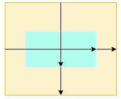
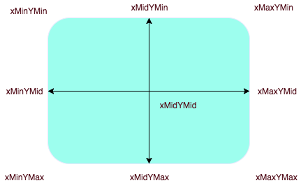

# svg快速入门

SVG 全称是 Scalable Vector Graphics，即，矢量图。在 Web 中使用 SVG 可以解决位图放大失真的问题。首先，不要把 SVG 和 CSS，Canvas，HTML 搞混。他们之间并没有你中有我，我中有你的关系。SVG 是通过 XML 的形式写在 HTML 文档中的。

## 如何书写
开篇说过，SVG 就是一个 XML。看一下代码吧：

    <svg x="0px" y="0px" width="450px" height="100px" viewBox="0 0 450 100">
     <rect x="10" y="5" fill="white" stroke="black" width="90" height="90"/>
     <circle fill="white" stroke="black" cx="170" cy="50" r="45"/>
     <polygon fill="white" stroke="black" points="279,5 294,35 328,40 303,62
      309,94 279,79 258,94 254,62 230,39 263,35"/>
     <line fill="none" stroke="black" x1="410" y1="95" x2="440" y2="6"/>
     <line fill="none" stroke="black" x1="360" y1="6" x2="360" y2="95"/>
    </svg>
<svg x="0px" y="0px" width="450px" height="100px" viewBox="0 0 450 100">
     <rect x="10" y="5" fill="white" stroke="black" width="90" height="90"/>
     <circle fill="white" stroke="black" cx="170" cy="50" r="45"/>
     <polygon fill="white" stroke="black" points="279,5 294,35 328,40 303,62
      309,94 279,79 258,94 254,62 230,39 263,35"/>
     <line fill="none" stroke="black" x1="410" y1="95" x2="440" y2="6"/>
     <line fill="none" stroke="black" x1="360" y1="6" x2="360" y2="95"/>
</svg>

## 基本概念
简单来说有 3 个基本概念：

viewport: 物理窗口
viewbox: 实物窗口（算了，下面解释）
preserveAspectRatio: 保留横纵比
我们接下来，一个一个的进行讲解吧。

### viewport
参照上面的 demo，这实际上就是你用 x,y,width,height。这 4 个属性，在页面上固定的矩形区域。

### viewbox 
定义 SVG 元素在 viewport 中的具体尺寸比例。假设有如下内容：
<svg width="500" height="200" viewBox="0 0 50 20" >
 <rect x="20" y="10" width="10" height="5"
          style="stroke: #000000; fill:none;"/>
</svg>

    <svg width="500" height="200" viewBox="0 0 50 20" >
    <rect x="20" y="10" width="10" height="5"
          style="stroke: #000000; fill:none;"/>
    </svg>  
* viewport 为 [0,0] 到 [500,200]
* viewbox 为 [0,0] 到 [50,20]

默认情况下 SVG 是自动填充满 viewport 的。注意，在 SVG 中，子标签的所有尺寸都是不能带单位的，因为初始单位就是根据上面两个概念确定。

当为以上情况，SVG 中基本的尺寸则不是 1px，而是 500/50 = 10px。所以，如下的图形大小为：

### preserveAspectRatio  

该属性就是用来定义上面 viewport 和 viewbox 相互对齐的方式。换句话就是说，它的属性可以改变 viewbox 的具体位置。基本格式为：

    <align> [<meetOrSlice>]

* align: 定义 viewport 和 viewbox 的对齐方式，分为 x,y 轴两个方向。X 轴方向有三种方式：左边重合（xMin），x 轴中点重合（xMid），右边重合（xMax）。同理，Y 轴也有 顶边重合（YMin），y 轴中点重合（YMid），底边边重合（YMax）

* meetOrSlice: 主要就是定义该 SVG 是内嵌，还是裁剪或是 none（听天有命）

其中，align 需要着重理解一下。首先，它的默认值为 xMidYMid，即为中点重合。

可以从图中看出，viewbox 是通过中心进行延展的。注意，它的原点坐标还是在 viewbox 的左上角。如果你是动态增加尺寸的话，此时并不是从左到右增加，而是从中心向两端扩张。同理，如果你使用的是 xMinYMin 的话，那么如果存在尺寸变化，那么相对点则是从左上角开始的。简单来说，align 相对点其实一共有 9 个。 

   

然后就是 meet || slice || none 这三个属性具体干的事情。

在这之前，我们需要了解一个公式–缩放比计算公式：

> vb_h * rat_y = vp_h; 或者 vb_w * rat_x = vp_w;

其中，vb_ 为 viewbox 简写，vp_ 为 viewport 的简写。vb_h 代表就是 viewbox height。vb_w 代表就是 viewbox width。rat_x/y 代表的是 x,y 轴的缩放比例。

    <svg width="400" height="200" viewBox="0 0 200 200" preserveAspectRatio="xMinYMin slice" style="border:1px solid #cd0000;">
        <rect x="10" y="10" width="150" height="150" fill="#cd0000"/>
    </svg>
那么，rat_x 和 rat_y 分别为：

* rat_x = 400/200 = 2
* rat_y = 200/200 = 1

现在，针对上面 meet/slice 不同的取值，实际应用到 svg 里面的缩放比例是不同的。

* meet(默认值): 本意是让 svg 尽可能的显示在 viewport 里，即，会在 rat_x 和 rat_y 中选择最小的值作为缩放标准。
* slice: 本意是让 svg 完全铺满 viewport，即，会在 rat_x 和 rat_y 中选择最大的值作为缩放标准。
所以针对不同的取值，基准比例也不同。

当为 meet 的情况，那么实际缩放比例为 1。则里面实际矩形的大小就为 (10,10) 到 (150,150)。    

<svg width="400" height="200" viewBox="0 0 200 200" preserveAspectRatio="xMinYMin meet" style="border:1px solid #cd0000;">
    <rect x="10" y="10" width="150" height="150" fill="#cd0000"/>
</svg>

当为 slice 的情况，那么实际缩放比例为 2。则里面实际矩形的大小就为 (20,20) 到 (300,300)。

<svg width="400" height="200" viewBox="0 0 200 200" preserveAspectRatio="xMinYMin slice" style="border:1px solid #cd0000;">
    <rect x="10" y="10" width="150" height="150" fill="#cd0000"/>
</svg>

如果你的值为 none 的话，他会直接铺满整个 viewport，即，实际矩形大小为：(20,10) 到 (300,150)。

<svg width="400" height="200" viewBox="0 0 200 200"  preserveAspectRatio="none"  style="border:1px solid #cd0000;">
    <rect x="10" y="10" width="150" height="150" fill="#cd0000"/>
</svg>